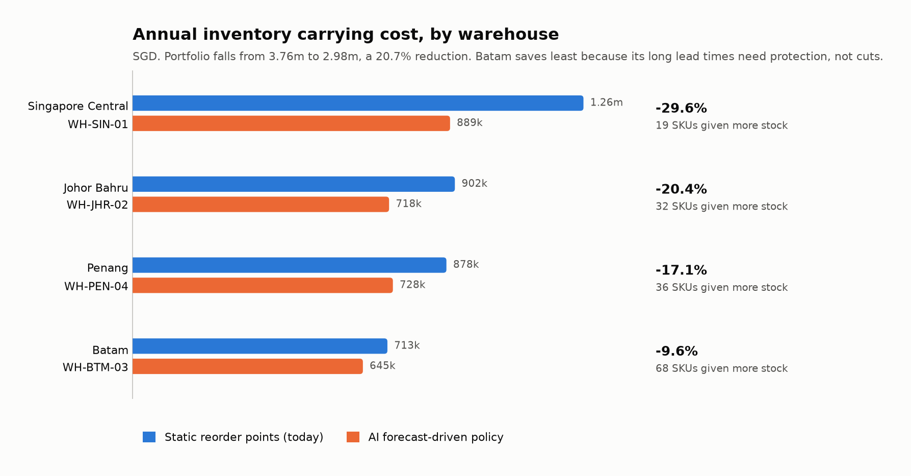
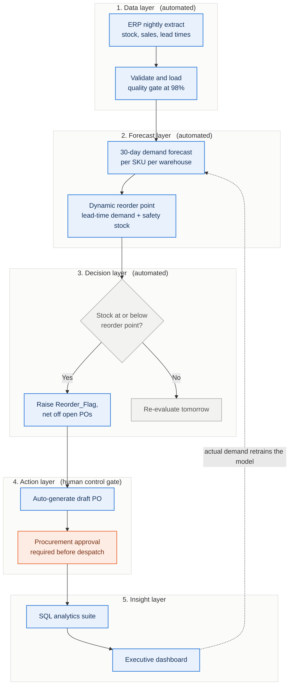
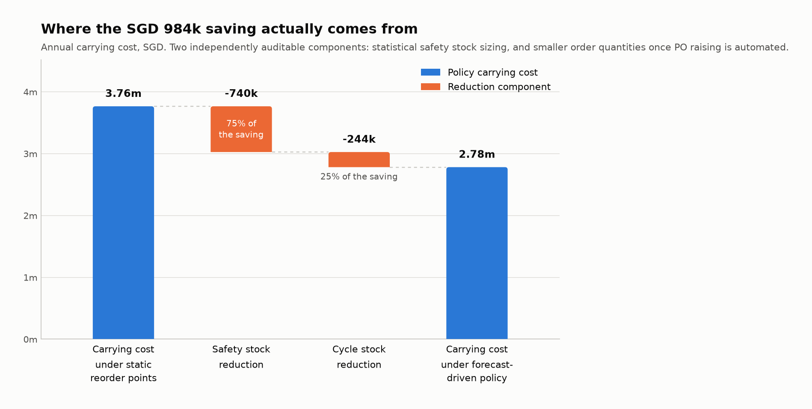
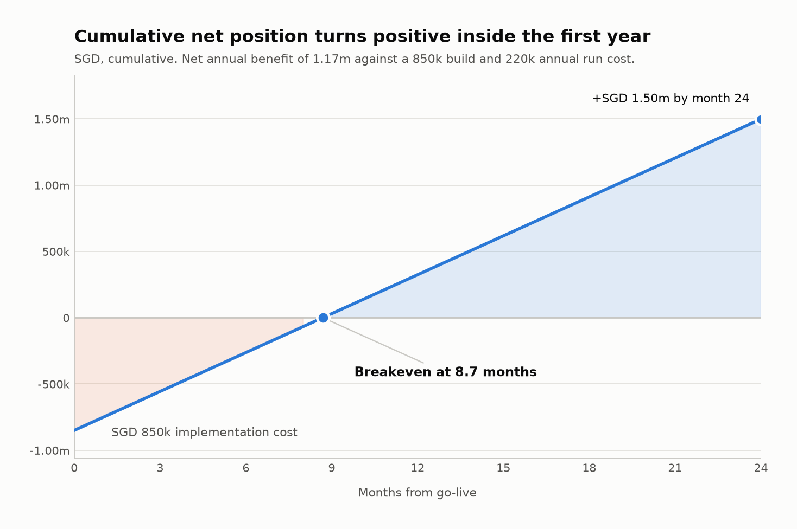
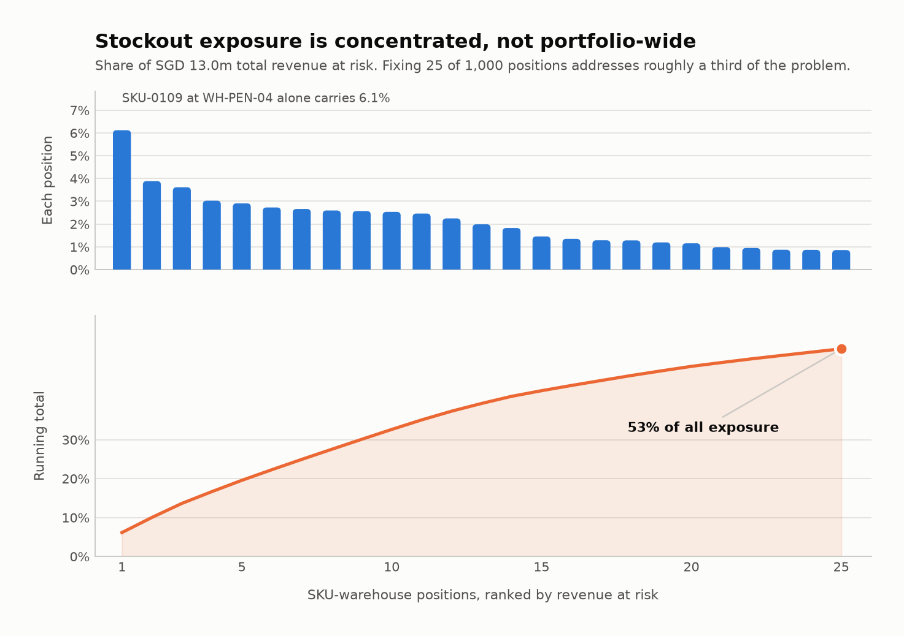
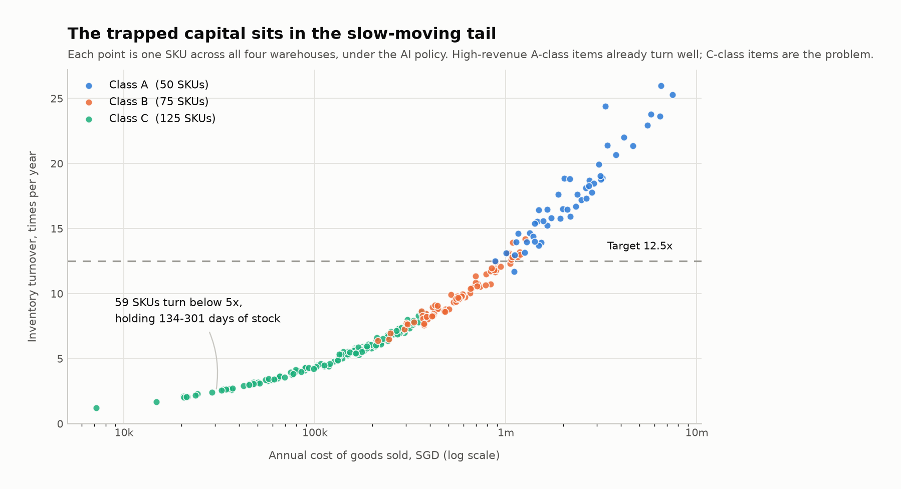

# AI-Powered Inventory Forecasting & Automated Replenishment System

**A Business Analysis portfolio project**


[](docs/)
[](data/)
[](sql/)

---

## Project Overview

This project works an end-to-end business analysis problem the way it would be worked in industry: from a stated operational pain, through requirements and process design, into data, SQL analytics, and a financial case an executive committee could actually vote on.

**The problem.** A regional distributor running four DCs (Singapore, Johor, Batam, Penang) replenishes ~1,000 SKU-warehouse positions using static reorder points held in spreadsheets and refreshed roughly quarterly. A fixed threshold cannot track demand that moves, so the business over-stocks slow movers *and* under-stocks fast movers at the same time, paying for both failures at once.

**The solution.** Replace the static threshold with a nightly AI demand forecast driving a dynamic reorder point, and auto-generate draft purchase orders, with Procurement retaining the approval gate.

**The result, computed from the dataset in this repository:**

| Outcome | Value |
|---|---|
| Annual carrying cost reduction | **SGD 776,086 (20.7%)** |
| One-time working capital released | **SGD 3,444,784** |
| Inventory turnover | **10.7x -> 13.2x** |
| Revenue at risk identified | **SGD 10.1M/yr (3.0% of revenue)** |
| Payback period | **8.7 months** |
| 3-year NPV @ 10% | **SGD 2,069,141** |

<picture>
  <source media="(prefers-color-scheme: dark)" srcset="presentation/charts/01-carrying-cost-by-warehouse-dark.png">
  
</picture>

### Academic Context

Built as a portfolio piece for entry-level Business Analyst roles, applying the MSc Management toolkit (requirements engineering, process modelling, quantitative analysis, and financial justification) to a single coherent supply chain problem. The emphasis throughout is on **traceability**: every requirement maps to a user story, every user story to acceptance criteria, and every number in the executive summary back to a SQL query and a source row.

> **On the data.** The dataset is synthetic and generated by a documented, seeded script. It is engineered to reproduce the failure modes described above so the analytical method can be demonstrated end to end. No confidential or proprietary company data is used, and the absolute figures would be restated against production data before any real funding decision.

---

## Key BA Deliverables

| # | Deliverable | File | What it demonstrates |
|---|---|---|---|
| 1 | **Business Requirements Document** | [`docs/BRD.md`](docs/BRD.md) | Executive summary, problem statement with root cause analysis, measurable objectives, in/out-of-scope, assumptions, constraints, dependencies, 15 functional and 12 non-functional requirements, risk register, sign-off |
| 2 | **User Stories & Acceptance Criteria** | [`docs/user_stories.md`](docs/user_stories.md) | 5 stories across 5 personas in standard format, 20 Given/When/Then criteria, MoSCoW priority, story points, requirements traceability matrix, Definition of Done |
| 3 | **Process Flows (AS-IS / TO-BE)** | [`docs/process_flows.md`](docs/process_flows.md) | BPMN-style swimlane diagrams in Mermaid, a replenishment sequence diagram, 7 documented pain points, AS-IS vs TO-BE comparison, retained controls |
| 4 | **Synthetic Dataset & Generator** | [`data/`](data/) | Reproducible, seeded, self-validating data generation with an explicit data dictionary and inventory-theory modelling |
| 5 | **SQL Analytics Suite** | [`sql/analysis_queries.sql`](sql/analysis_queries.sql) | 3 production-grade queries using CTEs and window functions, plus a zero-setup runner |
| 6 | **Executive Summary** | [`presentation/executive_summary.md`](presentation/executive_summary.md) | One-page business case, benefit decomposition, warehouse-level results, risk controls, funding ask |
| 7 | **Dashboard Wireframe & Build Guide** | [`presentation/dashboard_wireframe.md`](presentation/dashboard_wireframe.md) | Two-page dashboard design, KPI specifications, star schema, DAX measures, build sequence, reconciliation checklist |
| 8 | **Executive Chart Pack** | [`presentation/generate_charts.py`](presentation/generate_charts.py) | Five charts generated directly from the dataset, light and dark themes, colour-vision-deficiency validated palette |

---

## Repository Structure

```
ai-supply-chain-optimization-ba/
├── README.md                              Executive portfolio summary (this file)
├── docs/
│   ├── BRD.md                             Business Requirements Document
│   ├── user_stories.md                    User stories + Given/When/Then criteria
│   └── process_flows.md                   AS-IS / TO-BE Mermaid diagrams
├── data/
│   ├── generate_supply_chain_data.py      Seeded synthetic data generator
│   └── inventory_data.csv                 1,000 rows (250 SKUs x 4 warehouses)
├── sql/
│   ├── analysis_queries.sql               3 analytical queries (CTEs + window functions)
│   ├── run_analysis.py                    Zero-setup runner (in-memory SQLite)
│   └── output/                            Query result sets as CSV
└── presentation/
    ├── executive_summary.md               Business case for the steering committee
    ├── dashboard_wireframe.md             BI build guide and wireframes
    ├── generate_charts.py                 Chart generation from the source dataset
    └── charts/                            10 PNGs: 5 charts x light and dark themes
```

---

## How the System Works



The layers map one-to-one onto the deliverables in this repository: the data layer is
`data/generate_supply_chain_data.py`, the forecast and decision layers are the two policies
modelled below, the insight layer is `sql/analysis_queries.sql` feeding the dashboard designed
in `presentation/dashboard_wireframe.md`.

---

## The Analytical Model

Two replenishment policies are modelled explicitly so the difference between them can actually be *computed* instead of assumed.

```
Lead_Time_Demand   = Avg_Daily_Demand x Lead_Time_Days

  STATIC POLICY (legacy)                    AI POLICY (proposed)
  ----------------------                    --------------------
  Reorder point = flat 30-day cover         Reorder point = Lead_Time_Demand
                  on a stale demand                       + 1.645 x sigma x sqrt(Lead_Time_Days)
                  estimate                                  (95% service level)

  Order qty     = EOQ at SGD 550/PO         Order qty     = EOQ at SGD 450/PO
                  (manual keying,                           (automated draft, review only)
                   chasing, expediting)

Safety_Stock      = MAX(Reorder_Point - Lead_Time_Demand, 0)
Average_Inventory = Safety_Stock + Order_Quantity / 2
Carrying_Cost     = Average_Inventory x Holding_Cost_Per_Unit
```

Because both policies are computed from the same source rows, the saving decomposes into two independently auditable components, which is what Finance needs in order to sign off a benefit claim (US-05 / AC-05.1).

---

## Financial ROI Model

### Formula 1: Working Capital Reduction

```
Working_Capital_Reduction = Old_Carrying_Cost - New_AI_Optimised_Carrying_Cost

  where  Old_Carrying_Cost = SUM( (Static_Safety_Stock + Static_Order_Qty / 2)
                                  x Holding_Cost_Per_Unit )
         New_Carrying_Cost = SUM( (AI_Safety_Stock     + AI_Order_Qty / 2)
                                  x Holding_Cost_Per_Unit )
```

| Component | Annual value | Share |
|---|---|---|
| Safety stock reduction: statistical sizing replaces a flat 30-day buffer | SGD 510,250 | 65.7% |
| Cycle stock reduction: cheaper automated ordering permits smaller, more frequent orders | SGD 265,836 | 34.3% |
| **Total carrying cost reduction** | **SGD 776,086** | **20.7% of baseline** |

<picture>
  <source media="(prefers-color-scheme: dark)" srcset="presentation/charts/02-savings-waterfall-dark.png">
  
</picture>

Valued at unit cost instead of holding cost, the same inventory reduction releases **SGD 3,444,784** of working capital from the balance sheet (average inventory value SGD 18.14M -> SGD 14.69M).

### Formula 2: Revenue at Risk Recovered

```
Revenue_At_Risk   = SUM( Stockout_Events x Avg_Stockout_Duration
                         x Avg_Daily_Demand x Unit_Price )

Margin_Recovered  = Lost_Gross_Margin x True_Lost_Sales_Factor x Stockout_Reduction_Rate
                  = SGD 4,211,883 x 0.35 x 0.40
                  = SGD 589,664
```

Both multipliers are kept conservative on purpose, and both are stated openly: only **35%** of stockout demand is assumed genuinely lost (the remainder substitutes or backorders), and the system is credited with removing **40%** of stockout events, which is the BO-02 target rather than a best case.

### Formula 3: Net Benefit and Return

```
Gross_Annual_Benefit = Carrying_Cost_Reduction + Margin_Recovered + Productivity_Gain
Net_Annual_Benefit   = Gross_Annual_Benefit - Annual_Run_Cost
Payback_Months       = Implementation_Cost / (Net_Annual_Benefit / 12)
ROI_Year_1           = (Net_Annual_Benefit - Implementation_Cost) / Implementation_Cost
NPV_3yr              = SUM( Net_Annual_Benefit / (1 + r)^t )  for t = 1..3, r = 10%  - Implementation_Cost
```

| Line item | Amount (SGD) |
|---|---|
| Carrying cost reduction | 776,086 |
| Gross margin recovered from fewer stockouts | 589,664 |
| Planner productivity: 12 hrs/week released @ SGD 45/hr | 28,080 |
| **Gross annual benefit** | **1,393,830** |
| Annual run cost (cloud, model ops, licences) | (220,000) |
| **Net annual benefit** | **1,173,830** |
| One-time implementation cost | 850,000 |

| Metric | Result |
|---|---|
| **Payback period** | **8.7 months** |
| **Year-1 ROI** | **38.1%** |
| **3-year NPV @ 10% discount rate** | **SGD 2,069,141** |
| **3-year ROI** | **314%** |
| **One-time working capital release** | **SGD 3,444,784** |

<picture>
  <source media="(prefers-color-scheme: dark)" srcset="presentation/charts/05-roi-payback-dark.png">
  
</picture>

The working capital release is reported separately because it is a balance-sheet event, not recurring P&L. At SGD 3.4M, it is still the single largest cash item in the case.

**Cost assumptions.** Implementation of SGD 850,000 covers data engineering, model build, ERP integration, and change management across four DCs; annual run cost of SGD 220,000 covers cloud infrastructure, model operations, and BI licences. Both are stated assumptions for the purposes of this portfolio exercise and would be replaced by vendor quotes in a live business case.

---

## Reproducing the Analysis

### Prerequisites

```bash
python3 -m pip install pandas numpy
```

No database server is required, since the SQL runs against an in-memory SQLite instance.

### Step 1: Generate the dataset

```bash
python3 data/generate_supply_chain_data.py
```

Writes `data/inventory_data.csv` (1,000 rows) and prints a validation summary. The generator is seeded, so every run produces a byte-identical file. It self-validates on ten business rules (row count, key uniqueness, no nulls, non-negative stock, price above cost, reorder-flag consistency) and raises immediately if any is violated.

### Step 2: Run the SQL analysis

```bash
python3 sql/run_analysis.py                # print results to the console
python3 sql/run_analysis.py --csv          # also write result sets to sql/output/
python3 sql/run_analysis.py --rows 30      # show more rows per query
```

### Step 3: Regenerate the charts

```bash
python3 -m pip install matplotlib
python3 presentation/generate_charts.py
```

Writes ten PNGs to `presentation/charts/` (five charts, each in a light and a dark theme so they
stay legible whichever way GitHub is being viewed). Every value plotted is recomputed from
`inventory_data.csv` using the same definitions as the SQL, so the charts cannot drift away from
the queries.

### Step 4: Run the queries against your own database

`sql/analysis_queries.sql` is written in ANSI SQL and validated on SQLite 3.45. It runs unmodified on PostgreSQL 12+, Snowflake, BigQuery, and Redshift. No vendor-specific functions are used, and `GREATEST`/`LEAST` are written as portable `CASE` expressions. The commented `CREATE TABLE` DDL at the top of the file loads the CSV into a fresh database.

```bash
# PostgreSQL example
createdb inventory_demo
psql inventory_demo -c "$(sed -n '/^-- DROP TABLE/,/^-- \\\copy/p' sql/analysis_queries.sql | sed 's/^-- //')"
psql inventory_demo -f sql/analysis_queries.sql
```

---

## The SQL Suite

| Query | Business question | Techniques |
|---|---|---|
| **1. Revenue at Risk** | How much revenue have stockouts already cost us, how much is still exposed on today's stock position, and which SKUs concentrate that risk? | 4 chained CTEs; `ROW_NUMBER`, `RANK`, `NTILE(4)`; partitioned and unpartitioned `SUM() OVER ()`; running cumulative sum for Pareto analysis |
| **2. Carrying Cost Savings by Warehouse** | What does each warehouse save by replacing static thresholds with forecast-driven ones, and where does the saving come from? | 3 CTEs; policy simulation; saving decomposed into safety-stock and cycle-stock components; `RANK`, `SUM() OVER ()`, `AVG() OVER ()` for portfolio benchmarking |
| **3. Inventory Turnover across Top SKUs** | Which SKUs turn capital efficiently, and where is capital trapped? | 4 CTEs; grain change from SKU x warehouse up to SKU; annualisation; `RANK` partitioned by category; `NTILE(4)`; dual-segment output (top 30 by revenue **and** 15 slowest-turning) |

### Selected findings

- **Risk is concentrated.** The top 25 of 1,000 positions carry **31%** of total revenue at risk, so this is a manageable remediation list, not a portfolio-wide problem.
- **Savings are not uniform, and shouldn't be.** Singapore Central saves 29.6% while Batam saves 9.6%, because Batam's long lead times mean most of its correction is *protective*. Across the portfolio the model **increases** stock on **155 positions** that the static threshold was under-covering. The system reallocates inventory rather than simply cutting it.
<picture>
  <source media="(prefers-color-scheme: dark)" srcset="presentation/charts/03-revenue-at-risk-pareto-dark.png">
  
</picture>

- **The trapped capital is in the tail.** The top 30 SKUs by revenue all turn healthily at 15-26x. The problem sits in C-class items turning **1.1x-2.7x**, holding **135 to 300 days** of stock. Ranking by revenue alone would have hidden this finding completely, which is why Query 3 reports both segments.

---

<picture>
  <source media="(prefers-color-scheme: dark)" srcset="presentation/charts/04-inventory-turnover-dark.png">
  
</picture>

## Skills Demonstrated

| Domain | Evidence |
|---|---|
| **Requirements engineering** | BRD with 15 FRs and 12 NFRs, MoSCoW prioritisation, full traceability matrix |
| **Agile analysis** | User stories, Gherkin acceptance criteria, story point estimation, Definition of Done |
| **Process modelling** | AS-IS/TO-BE swimlane diagrams, sequence diagram, pain-point and control analysis |
| **Data analysis** | Python data engineering, statistical inventory modelling, self-validating pipeline |
| **SQL** | CTEs, window functions, running aggregates, grain changes, dialect-portable ANSI SQL |
| **Financial modelling** | ROI, NPV, payback, working capital analysis, decomposed and auditable benefit claims |
| **Stakeholder communication** | Executive summary, dashboard design, persona-driven requirements |
| **Domain knowledge** | EOQ, safety stock, service levels, reorder points, ABC classification, inventory turnover |

---

## Tooling and AI Use

This project was built with Claude Code as a pair-programming partner, used for scaffolding the
data generator, drafting documentation, and writing the SQL and charting code.

The analytical judgement is mine, and I can walk through any of it. Three decisions worth asking
me about:

- **Modelling both policies side by side.** The legacy static policy and the AI policy are computed
  from the same source rows, so the saving is calculated rather than asserted, and it decomposes
  into safety stock and cycle stock components that Finance can audit separately.
- **Recalibrating the ROI model.** The first pass produced a 740% first-year return and a 1.4-month
  payback. Those numbers would not survive a finance review, so the cost base and the lost-sales
  assumption were rebuilt to something defensible: 38% year-one ROI on an 8.7-month payback, with
  the conservative multipliers stated openly rather than buried.
- **Reporting two SKU segments, not one.** Ranking by revenue alone was self-fulfilling, since
  high-revenue SKUs are high-velocity by construction and all looked healthy. Query 3 also returns
  the slowest-turning SKUs, which is where the trapped working capital actually sits.

Every figure in this repository is reproducible from `data/generate_supply_chain_data.py` and
`sql/analysis_queries.sql`, so any claim here can be checked against the source rows.

---

## Author

**MSc in Management, Singapore Management University**
Portfolio project for entry-level Business Analyst roles in supply chain, operations, and data analytics.

*Synthetic data throughout. No proprietary or confidential information is used.*
