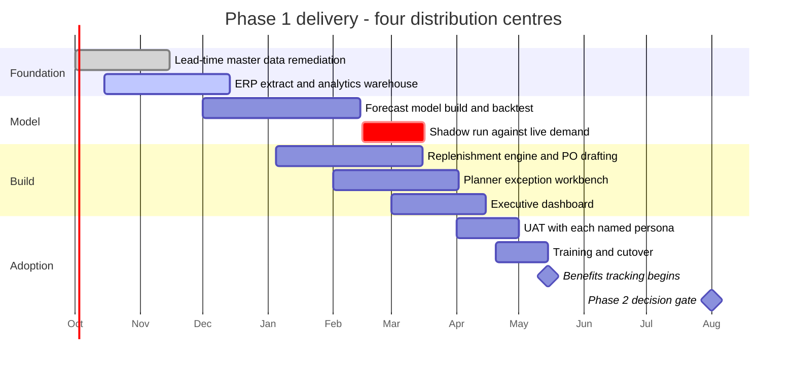

# Business Requirements Document (BRD)
## Demand Forecasting & Automated Replenishment System

| Field | Detail |
|---|---|
| **Document ID** | BRD-SCM-001 |
| **Version** | 1.0 |
| **Status** | Approved for Build |
| **Author** | Business Analyst (MSc Management, Singapore Management University) |
| **Business Sponsor** | VP, Supply Chain Operations |
| **Key Stakeholders** | Demand Planning, Warehouse Operations, Procurement, Finance (Working Capital), Data Engineering |
| **Last Updated** | 2026-09-02 |

---

## 1. Executive Summary

The organisation operates a regional distribution network of four warehouses (Singapore, Johor, Batam, Penang) carrying approximately 1,000 active SKU-warehouse combinations. Replenishment is currently governed by **static reorder points** maintained manually in spreadsheets and refreshed on an ad-hoc quarterly cycle.

This static approach fails in two directions simultaneously:

- **Over-stocking** on slow-moving SKUs, inflating carrying cost and locking up working capital in inventory that turns fewer than five times per year.
- **Under-stocking** on volatile, fast-moving SKUs, producing stockouts that translate directly into lost revenue and degraded service levels.

This project proposes an **AI demand-forecasting engine** feeding a **rules-based automated replenishment layer**. The forecast produces a per-SKU, per-warehouse 30-day demand projection; the replenishment layer converts that forecast into a dynamic reorder point (lead-time demand plus statistically sized safety stock) and raises draft purchase orders automatically when on-hand stock breaches that point.

**Expected business outcome** (baseline case, quantified in `README.md` and validated in `sql/analysis_queries.sql`):

| Metric | Target |
|---|---|
| Reduction in inventory carrying cost | 20-26% |
| Reduction in stockout events | ≥ 40% |
| Reduction in planner manual effort | ~12 hours/week |
| Payback period on build cost | < 9 months |

---

## 2. Problem Statement

> Replenishment decisions are made on stale, manually maintained reorder points that do not account for demand volatility, seasonality, or supplier lead-time variability. The result is a portfolio that is simultaneously over-invested in slow movers and under-served on fast movers.

### 2.1 Root Cause Analysis

| # | Root Cause | Business Consequence | Evidence Source |
|---|---|---|---|
| RC-01 | Reorder points are fixed constants, refreshed quarterly at best | Thresholds are wrong for most of the quarter | Planner spreadsheet audit |
| RC-02 | No statistical safety stock; buffers are set by planner intuition | Inconsistent service levels across warehouses | Stockout events by warehouse |
| RC-03 | Supplier lead-time variability is not modelled | In-transit gaps become stockouts | Lead time vs. stockout correlation |
| RC-04 | Purchase order creation is fully manual (~4 min/PO) | Planner capacity is consumed by transactional work | Time-and-motion observation |
| RC-05 | No single source of truth for stock position | Duplicate and late orders | ERP vs. spreadsheet reconciliation |

### 2.2 Quantified Pain (Current State Baseline)

- **Revenue at risk from stockouts**: lost unit sales during stockout windows, priced at list (computed in Query 1).
- **Excess carrying cost**: the delta between inventory held under static thresholds and inventory required under a forecast-driven policy (computed in Query 2).
- **Capital efficiency**: inventory turnover below the 12.5x internal target on a material share of the portfolio, with slow-moving C-class SKUs turning fewer than 5 times a year (computed in Query 3).

---

## 3. Business Objectives & Success Criteria

| ID | Objective | KPI | Baseline | Target | Measurement Window |
|---|---|---|---|---|---|
| BO-01 | Reduce working capital tied up in inventory | Average inventory carrying cost (SGD/yr) | Static-policy baseline | -15% | 2 quarters post go-live |
| BO-02 | Improve product availability | Stockout events per 1,000 SKU-weeks | Current YTD rate | -40% | 2 quarters post go-live |
| BO-03 | Automate transactional replenishment | % of POs raised without manual keying | 0% | ≥ 80% | 1 quarter post go-live |
| BO-04 | Improve capital efficiency | Portfolio inventory turnover ratio | 10.8x (static policy) | ≥ 12.5x | 4 quarters post go-live |
| BO-05 | Establish forecast trust | Forecast MAPE on A-class SKUs, 30-day bucket | n/a | ≤ 15% | Continuous |

---

## 4. Scope

### 4.1 In Scope

| ID | Item | Description |
|---|---|---|
| IS-01 | AI demand forecast engine | 30-day forward unit demand per SKU per warehouse, refreshed nightly |
| IS-02 | Dynamic reorder point calculation | Lead-time demand + safety stock sized from forecast error and service-level target |
| IS-03 | Automated reorder flagging | System-generated `Reorder_Flag` when on-hand ≤ dynamic reorder point |
| IS-04 | Draft purchase order generation | Auto-created draft PO routed to Procurement for approval |
| IS-05 | Planner exception workbench | Review, override, and approve queue with mandatory override reason codes |
| IS-06 | Executive KPI dashboard | Carrying cost, stockouts, turnover, revenue at risk, forecast accuracy |
| IS-07 | Four pilot warehouses | SIN-01, JHR-02, BTM-03, PEN-04 |
| IS-08 | Finished-goods SKUs | Active SKUs with ≥ 6 months of sales history |
| IS-09 | Audit trail | Full logging of forecast inputs, thresholds, flags, and overrides |

### 4.2 Out of Scope

| ID | Item | Rationale / Deferred To |
|---|---|---|
| OOS-01 | Supplier price negotiation and sourcing strategy | Owned by Strategic Sourcing; no system dependency |
| OOS-02 | Transportation route and carrier optimisation | Separate TMS initiative, FY+1 |
| OOS-03 | Raw material and WIP inventory | Phase 2; requires MRP integration |
| OOS-04 | New product introduction (NPI) forecasting | No sales history; remains manual/analogue-based |
| OOS-05 | Automatic PO transmission to suppliers without human approval | Deliberate control: Procurement approval retained in Phase 1 |
| OOS-06 | Warehouse slotting and physical layout | Out of problem domain |
| OOS-07 | Replacement of the ERP system of record | System integrates with ERP; does not replace it |
| OOS-08 | Retail store-level replenishment | Distribution centres only in Phase 1 |

### 4.3 Assumptions

| ID | Assumption |
|---|---|
| A-01 | ERP exposes on-hand stock and sales history via nightly batch extract |
| A-02 | Supplier lead times are maintained in the vendor master and reasonably accurate |
| A-03 | Minimum 6 months of clean sales history exists for in-scope SKUs |
| A-04 | Procurement retains final approval authority on all POs in Phase 1 |
| A-05 | Unit costs and holding cost rates are provided and maintained by Finance |

### 4.4 Constraints

| ID | Constraint |
|---|---|
| C-01 | Forecast refresh must complete within the 02:00-04:00 SGT batch window |
| C-02 | No change to the ERP data model; integration is read-only plus PO write-back |
| C-03 | Phase 1 budget covers four warehouses only |
| C-04 | Solution must comply with Singapore PDPA for any customer-linked data |

### 4.5 Dependencies

| ID | Dependency | Owner |
|---|---|---|
| D-01 | Nightly ERP extract of stock and sales | Data Engineering |
| D-02 | Vendor master lead-time data quality remediation | Procurement |
| D-03 | Finance sign-off on holding cost rate methodology | Finance |
| D-04 | BI platform licences for the executive dashboard | IT |

---

## 5. Functional Requirements

| ID | Requirement | Priority (MoSCoW) | Acceptance Reference |
|---|---|---|---|
| FR-01 | The system shall generate a 30-day forward demand forecast for every in-scope SKU-warehouse pair, refreshed nightly. | Must | US-01 |
| FR-02 | The system shall calculate a dynamic reorder point as `(Avg_Daily_Demand x Lead_Time_Days) + Safety_Stock`, where safety stock is derived from forecast error and the configured service level. | Must | US-01, US-02 |
| FR-03 | The system shall set `Reorder_Flag = 1` when `Current_Stock ≤ Dynamic_Reorder_Point`. | Must | US-02 |
| FR-04 | The system shall automatically create a draft purchase order for every flagged SKU, with suggested order quantity, supplier, and expected receipt date. | Must | US-02 |
| FR-05 | The system shall route every draft PO to Procurement for approval before transmission; no PO shall be sent to a supplier without approval. | Must | US-02 |
| FR-06 | The system shall allow a planner to override a suggested order quantity, and shall require a reason code and free-text justification for every override. | Must | US-03 |
| FR-07 | The system shall present an exception workbench listing flagged SKUs ranked by revenue at risk. | Must | US-03 |
| FR-08 | The system shall display forecast accuracy (MAPE) per SKU and per warehouse for the trailing 90 days. | Should | US-04 |
| FR-09 | The system shall provide an executive dashboard reporting carrying cost, stockout events, inventory turnover, and revenue at risk, refreshed daily. | Must | US-04 |
| FR-10 | The system shall compute and report carrying cost savings of the forecast-driven policy versus the static-threshold baseline. | Should | US-04, US-05 |
| FR-11 | The system shall retain a full audit trail of forecast inputs, computed thresholds, flags, overrides, and PO actions for 24 months. | Must | US-05 |
| FR-12 | The system shall alert the demand planner when forecast MAPE for an A-class SKU exceeds 25% for three consecutive cycles. | Should | US-04 |
| FR-13 | The system shall allow configuration of the target service level (default 95%) per warehouse. | Could | US-01 |
| FR-14 | The system shall exclude SKUs with fewer than 6 months of history from automated flagging and route them to a manual queue. | Must | US-03 |
| FR-15 | The system shall support bulk approval of draft POs below a configurable value threshold. | Could | US-02 |

---

## 6. Non-Functional Requirements

| ID | Category | Requirement | Target |
|---|---|---|---|
| NFR-01 | Performance | Nightly forecast batch for the full SKU portfolio | Completes in ≤ 60 minutes |
| NFR-02 | Performance | Exception workbench page load | ≤ 3 seconds at P95 |
| NFR-03 | Availability | Replenishment service uptime during business hours (08:00-20:00 SGT) | 99.5% monthly |
| NFR-04 | Scalability | SKU-warehouse pairs supported without re-architecture | 10,000 (10x Phase 1) |
| NFR-05 | Accuracy | Forecast MAPE on A-class SKUs, measured on a held-out window at the 30-day bucket | ≤ 15% (13.4% achieved in the reference build) |
| NFR-06 | Security | Access control | Role-based; PO approval restricted to Procurement role |
| NFR-07 | Compliance | Personal data handling | Singapore PDPA compliant; no customer PII in forecast store |
| NFR-08 | Auditability | Immutable audit log retention | 24 months |
| NFR-09 | Usability | Planner proficiency after training | Productive within one 2-hour session |
| NFR-10 | Maintainability | Model retraining | Automated monthly; documented rollback to prior model version |
| NFR-11 | Data Quality | In-scope records passing validation before forecast run | ≥ 98%; failures quarantined and reported |
| NFR-12 | Recoverability | Recovery point / recovery time objective | RPO 24h, RTO 4h |

---

## 7. Business Process Impact

| Process | AS-IS | TO-BE | Impact |
|---|---|---|---|
| Stock review | Manual weekly spreadsheet review | Continuous automated evaluation | Planner time reallocated to exceptions |
| Reorder decision | Planner judgement vs. static threshold | Forecast-driven dynamic threshold | Consistent, auditable decisions |
| PO creation | Manual keying, ~4 min/PO | Auto-generated draft | ~80% effort reduction |
| PO approval | Informal, verbal | Structured approval queue | Control strengthened |
| Performance reporting | Monthly manual deck | Daily automated dashboard | Faster corrective action |

See `docs/process_flows.md` for the AS-IS and TO-BE BPMN-style flow diagrams.

---

## 8. Risks

| ID | Risk | Likelihood | Impact | Mitigation |
|---|---|---|---|---|
| R-01 | Planners distrust the forecast and override systematically | High | High | Shadow-run for 4 weeks; publish accuracy; track override rate as an adoption KPI |
| R-02 | Poor lead-time master data degrades reorder points | Medium | High | Data remediation sprint (D-02) before go-live; lead-time variance monitoring |
| R-03 | Forecast degrades under demand shock or promotion | Medium | Medium | MAPE alerting (FR-12); manual override path always available |
| R-04 | Automated POs create over-ordering if a bug goes undetected | Low | High | Human approval gate (FR-05); daily PO value cap; anomaly alerting |
| R-05 | ERP batch extract fails or arrives late | Medium | Medium | Fail-safe to prior-day thresholds; alert to Data Engineering |
| R-06 | Benefits not realised because savings are re-spent on buffer stock | Medium | Medium | Finance tracks working capital release as a governed KPI (BO-01) |

---

## 9. Solution Approach (High Level)

1. **Data layer:** nightly ERP extract landed to the analytics warehouse; the simulated equivalent used for this portfolio build is produced by `data/01_generate_demand_history.py`.
2. **Forecast layer:** four candidate methods per SKU-warehouse (28-day mean, seasonal naive,
   month-of-year seasonal index, damped Holt-Winters, plus Croston/SBA where demand is
   intermittent), selected on a rolling-origin backtest and combined by equal weight unless a
   single method wins decisively. Produces `Demand_Forecast_AI` (30-day units) and the measured
   forecast error that sizes safety stock. Implemented in `data/02_forecast_demand.py`.
3. **Decision layer:** dynamic reorder point computation and `Reorder_Flag` assignment.
4. **Action layer:** draft PO generation and routing to the Procurement approval queue.
5. **Insight layer:** SQL analytics (`sql/analysis_queries.sql`) feeding the executive dashboard described in `presentation/dashboard_wireframe.md`.

### 9.1 Implementation Roadmap

The shadow run is marked critical deliberately. It is the control that answers R-01: planners see
the forecast run alongside their own thresholds for four weeks before a single automated order is
raised, so trust is established against real demand rather than asserted in a training session.

---

## 10. Acceptance & Sign-Off

The solution is accepted when:

- All **Must** functional requirements are delivered and demonstrated in UAT.
- All user stories in `docs/user_stories.md` pass their Given/When/Then acceptance criteria.
- NFR-01, NFR-03, and NFR-05 are evidenced over a 4-week stabilisation period.
- Finance validates the carrying cost savings calculation methodology in Query 2.

| Role | Name | Signature | Date |
|---|---|---|---|
| Business Sponsor | VP, Supply Chain Operations | | |
| Process Owner | Head of Demand Planning | | |
| Finance | Director, Working Capital | | |
| Business Analyst | | | |

---

## Appendix A: Glossary

| Term | Definition |
|---|---|
| **Reorder Point (ROP)** | Stock level at which a replenishment order is triggered |
| **Safety Stock** | Buffer inventory held to absorb demand and lead-time variability |
| **Carrying / Holding Cost** | Annual cost of holding one unit in stock (capital, storage, insurance, obsolescence) |
| **Inventory Turnover** | Cost of goods sold divided by average inventory value, per year |
| **MAPE** | Mean Absolute Percentage Error, a measure of forecast accuracy |
| **Revenue at Risk** | Value of sales lost or exposed due to stock unavailability |
| **A/B/C Class** | Pareto classification of SKUs by revenue contribution |
| **Stockout** | Event where on-hand stock reaches zero against open demand |
