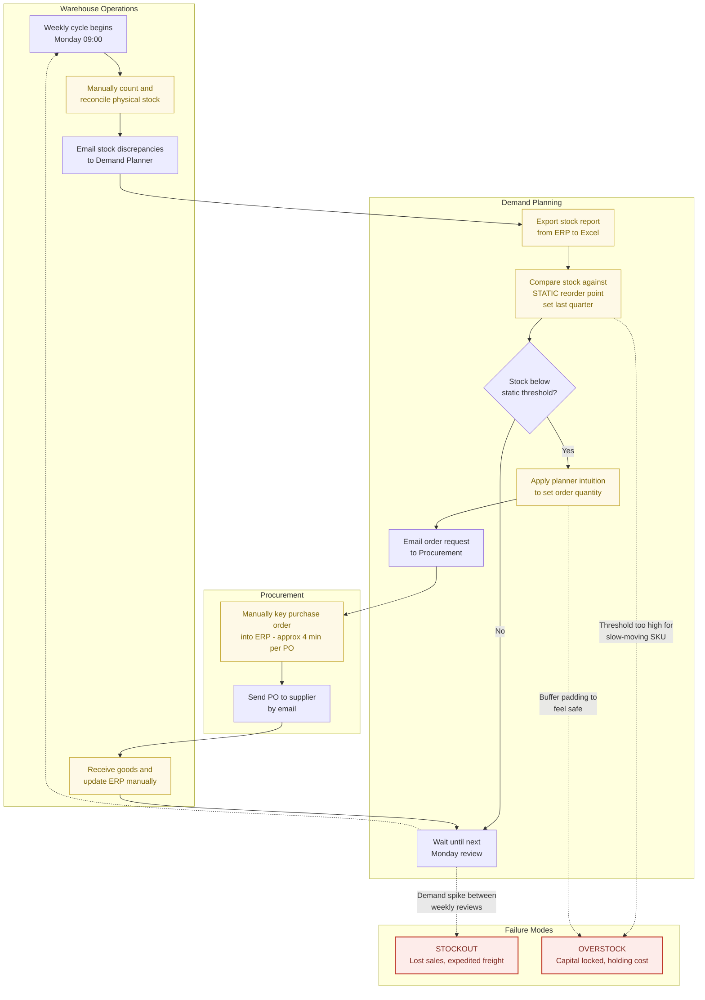
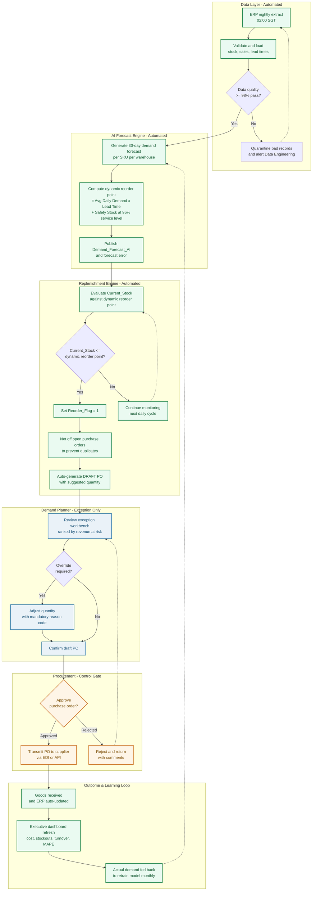
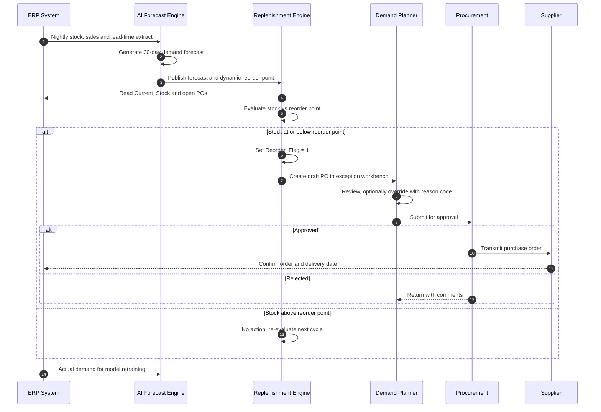

# Process Flow Diagrams (AS-IS / TO-BE)
## AI-Powered Inventory Forecasting & Automated Replenishment System

**Related documents:** `docs/BRD.md` (BRD-SCM-001), `docs/user_stories.md`
**Notation:** BPMN-style swimlane flows rendered in Mermaid.js. GitHub, GitLab, Notion, Confluence, and VS Code render these natively.

---

## 1. AS-IS Process: Manual Inventory Tracking & Purchase Order Creation

### 1.1 Narrative

Replenishment runs on a **weekly manual cycle**. The Demand Planner exports stock from the ERP into a spreadsheet, compares each SKU against a static reorder point last refreshed at some point in the previous quarter, and applies personal judgement to decide what to order. Purchase orders are keyed by hand into the ERP at roughly four minutes each. Because the review is weekly and the thresholds are stale, a SKU can sit below cover for up to six days before anyone notices, and the first signal is often a customer complaint rather than the process itself.

### 1.2 AS-IS Diagram

### 1.3 AS-IS Pain Points

| # | Step | Pain Point | Business Impact | BRD Root Cause |
|---|---|---|---|---|
| P1 | Manual stock count | Error-prone, point-in-time only | Decisions made on inaccurate stock | RC-05 |
| P2 | Excel export | No single source of truth; version sprawl | Duplicate and conflicting orders | RC-05 |
| P3 | Static reorder point | Ignores seasonality, trend, and volatility | Simultaneous overstock and stockout | RC-01 |
| P4 | Planner intuition | Inconsistent, undocumented, unauditable | Unpredictable service levels | RC-02 |
| P5 | Manual PO keying | ~4 minutes per PO, ~12 hours per week | Planner capacity consumed by admin | RC-04 |
| P6 | Weekly cadence | Up to 6-day detection lag | Avoidable stockouts | RC-01 |
| P7 | Lead time ignored | Supplier variability unmodelled | In-transit gaps become stockouts | RC-03 |

**Cycle time (AS-IS):** demand signal to PO transmitted = **3 to 9 days**.

---

## 2. TO-BE Process: AI Forecast Integration with Automated PO Triggers

### 2.1 Narrative

The ERP extract lands nightly and feeds an **AI forecasting engine** that produces a 30-day demand projection per SKU per warehouse. The engine computes a **dynamic reorder point** (lead-time demand plus statistically sized safety stock) and evaluates every SKU daily. Breaches raise `Reorder_Flag = 1` and generate a **draft purchase order** automatically. The Demand Planner works only the exception queue, ranked by revenue at risk, and Procurement retains the approval gate before any PO reaches a supplier. Actual demand is fed back to the model, closing the learning loop.

### 2.2 TO-BE Diagram

### 2.3 Replenishment Trigger Sequence

### 2.4 AS-IS vs TO-BE Comparison

| Dimension | AS-IS | TO-BE | Improvement |
|---|---|---|---|
| Review cadence | Weekly, manual | Daily, automated | 7x faster detection |
| Reorder point basis | Static, quarterly | Dynamic, nightly forecast | Adaptive to demand |
| Safety stock method | Planner intuition | Statistical, service-level driven | Consistent, auditable |
| Lead-time handling | Ignored | Modelled in reorder point | Closes in-transit gap |
| PO creation | Manual keying, ~4 min | Auto-generated draft | ~80% effort reduction |
| PO approval | Informal / verbal | Structured approval gate | Control strengthened |
| Planner focus | All SKUs, transactional | Exceptions ranked by risk | Capacity redeployed |
| Cycle time (signal to PO) | 3-9 days | Under 24 hours | Up to 90% reduction |
| Auditability | Email and spreadsheet trail | Full immutable audit log | Audit-ready |
| Reporting | Monthly manual deck | Daily automated dashboard | Faster correction |

### 2.5 Controls Retained by Design

Automation stops short of full autonomy in Phase 1, by design:

1. **Human approval gate:** no PO reaches a supplier without Procurement approval (FR-05, OOS-05).
2. **Mandatory override reason codes:** planner judgement is permitted but always recorded (FR-06).
3. **Data quality gate:** a failed extract keeps the previous day's thresholds in force instead of acting on bad data (AC-01.4).
4. **Duplicate-order netting:** open POs are netted off before a new draft is raised (AC-02.5).
5. **Model degradation alerting:** sustained MAPE breaches escalate to a human owner (FR-12).
